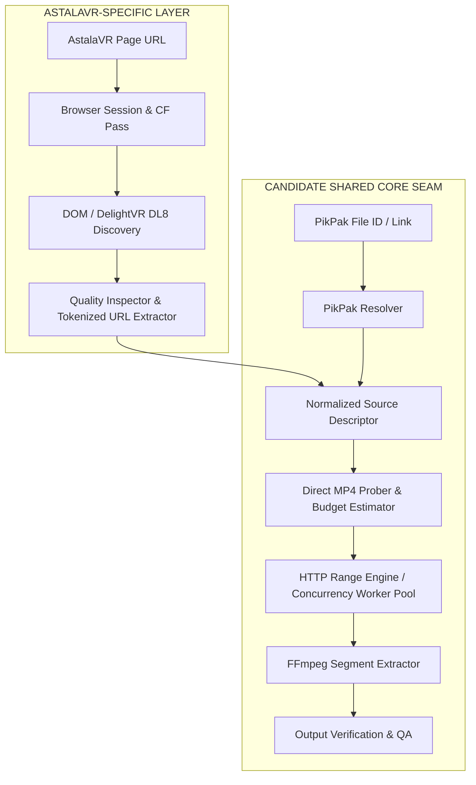

# AstalaVR Source Capability Boundary Research

> **Target Issue**: [#3 Turn AstalaVR reconnaissance into a source capability boundary](https://github.com/carllx/javr-sourcecut/issues/3)  
> **Research Branch**: `research/astalavr-capability-boundary`  
> **Primary Evidence**: [`docs/research/evidence/astalavr-pO1k7-probe.md`](file:///E:/PROJECTS/javr-sourcecut/docs/research/evidence/astalavr-pO1k7-probe.md)  
> **Status**: Rework Complete / Ready for Browser Lead Review  
> **Evidence Classification**: `[VERIFIED]` / `[REPORTED]` / `[INFERRED]` / `[UNKNOWN]`

---

## 1. Executive Summary & Objective

本调研的目标是将 AstalaVR 的侦察证据（Reconnaissance Data）与受控实验结果转化为一份**严格定级的 Source Capability Boundary（源能力边界）**文档，为 `javr-sourcecut` 的核心架构决策提供依据。

### 核心定界原则
1. **区分平台特有 vs 共享机制**：严格隔离 AstalaVR 平台特有的页面/会话/Token 机制与跨平台通用的 MP4 Range/FFmpeg 切片提取机制。
2. **能力边界而非代码实现**：不预设具体类名或最终 Adapter 代码实现，仅定义职责边界、输入输出契约与依赖约束。
3. **证据等级严格定级**：
   - `[VERIFIED]`：在本 repo 提交的直接可复核一手证据（如 `docs/research/evidence/astalavr-pO1k7-probe.md`）直接证明的事实。
   - `[REPORTED]`：在历史抽样或历史会话中观察到的现象，尚未在本轮提供完整自包含复现记录。
   - `[INFERRED]`：基于协议规范、标准播放器与 CDN 行为的合理架构推断。
   - `[UNKNOWN]`：尚未实测，必须在后续阶段设计验证 Hook 的未知项。
4. **合规与授权边界**：仅使用合法浏览器会话进行受控 probing（HEAD / bounded Range / ffprobe），设置 8 MiB 硬上限，不下载完整视频，不研究 DRM 绕过或访问控制逆向。

---

## 2. Primary Reproducible Evidence Base

本次定级以随代码库提交的以下一手复现证据为直接基准：

- **Sample Probe Evidence**: [`docs/research/evidence/astalavr-pO1k7-probe.md`](file:///E:/PROJECTS/javr-sourcecut/docs/research/evidence/astalavr-pO1k7-probe.md)
  - **Sample Page ID**: `pO1k7`
  - **Player Discovery**: Delight VR `<dl8-video>` 元素，`format="STEREO_180_TB"`, `fps="30"`, `aspect="1080:610"`, `display-mode="inline"`。
  - **Quality List & Highest**: 页面公开 `720P` 及 `1080P`；最高公开质量为 `1080P`（对应 `/pO1k7/1080P.mp4`，该页面无 4K/8K 声明）。
  - **Transport & Range**: HTTP 206 Partial Content 请求成功，返回 `Content-Range: bytes 0-5242879/531002202`，`Accept-Ranges: bytes`，`Content-Length: 5242880`（5.00 MiB 采样，未触发 HTTP 200 全量回退）。
  - **FFprobe Verification**: 5.00 MiB 头部切片成功解析 FastStart `moov` atom，读取到视频流 H.264 High (`avc1`, 2160x2160 @ 30fps, SAR 1:1, DAR 1:1) 及音频流 AAC LC (`mp4a`, 48000 Hz, stereo, duration: 1698.0s)。
  - **DRM Observation**: 拦截 `navigator.requestMediaKeySystemAccess` 记录 0 次调用，无 license 请求；本样本未检测到 DRM。
  - **Session & Cloudflare Protection**: 非会话外部请求返回 403 Forbidden；合法浏览器会话及携带的短期 Token 是通过 CDN 防护的必要条件。

---

## 3. Capability Boundary Matrix (能力边界矩阵)

### 3.1 ASTALAVR-SPECIFIC (平台特有能力边界)

本层负责与 AstalaVR 站点的特有业务与前端逻辑对接，对外输出标准化的媒体描述符（Source Descriptor）。

| 能力项 | 证据等级 | 详细说明与契约要求 |
| :--- | :---: | :--- |
| **Page Resolver** | `[VERIFIED]` | 输入 AstalaVR 视频页面 URL（如 `https://astalavr.com/videos/<id>/<slug>`），通过合法浏览器会话加载页面，提取视频 ID、标题、VR 格式属性（已在 `pO1k7` 验证 `format="STEREO_180_TB"`，历史 Reported 包含 `STEREO_180_LR`）。 |
| **Player / Source Discovery** | `[VERIFIED]` | 定位 Delight VR `<dl8-video>` 及其内部 `<source>` 标签，解析提取可用的 CDN Direct MP4 地址及对应标签（如 `720P`, `1080P`，历史 Reported 包含 `1440P`, `4K`）。 |
| **Quality Inspector & Mapping** | `[VERIFIED]` | **质量标签不等于实际分辨率**： • `pO1k7` 样本中标签 `1080P` 实际 coded resolution 为 `2160x2160`（Top-Bottom 双目，单眼 `2160x1080`）； • 历史 Reported 4K 样本对应 coded resolution 为 `4096x2048`（SBS 双目，单眼 `2048x2048`）； • 标题宣称的 `8K` 在公开流中不可用，严禁盲猜 4320P 等 URL。 |
| **Browser Session & Anti-Bot** | `[VERIFIED]` | 站点与 CDN 受 Cloudflare 保护，外部裸请求返回 403，必须依赖合法浏览器会话与凭证建立会话并请求媒体流。 |
| **Ephemeral Media URL Lifecycle** | `[VERIFIED]` | 媒体 URL 附带签名 Token（如 `?token=...`），具备时效性。解析器获取的 URL 为**临时凭证**，禁止作为持久存储的媒体全局唯一标识。 |
| **Token Acquisition & Refresh** | `[REPORTED]` | 长切片提取或断点时若 Token 过期，需要有机制通过当前会话重新触发页面解析以获取新 Token 的媒体 URL。 |

---

### 3.2 POSSIBLE SHARED SEAM (候选共享抽象层)

本层是 `javr-sourcecut` 通用的核心组件（Core Seams），可与 PikPak 及其他基于 HTTP Direct MP4 / Range 的源适配器共享。

| 能力项 | 证据等级 | 详细说明与候选共享契约 |
| :--- | :---: | :--- |
| **Normalized Source Identity** | `[INFERRED]` | 统一的源标识模型：`SourceDescriptor { source_id, provider: 'astalavr', display_title, vr_format, qualities: [...] }`。上层仅感知标准源模型，解耦具体平台 URL。 |
| **Edit Decision / Time Ranges (EDL)** | `[INFERRED]` | 统一的时间切片与剪辑决策模型：`CutSegment { start_time, end_time, target_fps, transcode_mode }`，完全与源提供者独立。 |
| **Direct MP4 Bounded Probing** | `[VERIFIED]` | **FastStart Moov Probe**：针对支持 HTTP Range 的 MP4 视频，仅发起小范围（如首部 5MB）Range 请求读取 `moov` atom，利用 `ffprobe` 快速判定 coded resolution、codec (H.264/HEVC)、fps、duration、bitrate（已在 `pO1k7` 样本验证）。 |
| **HTTP Range Transport** | `[VERIFIED]` | 标准 HTTP 206 Partial Content 请求传输层：支持指定 Byte Range 请求、Header 注入、连接重试与分块接收（已在 `pO1k7` 样本验证 206 及 `Content-Range`）。 |
| **Transfer Budgeting** | `[INFERRED]` | 传输预算控制：根据剪辑区间与码率估算所需下载的数据量，避免全量下载大文件，实施精确 Range 提取以节省带宽与磁盘。 |
| **Concurrency & Chunk Controls** | `[INFERRED]` | 并发分片下载/提取调度器：支持单文件多 Range 并发或多切片流水线作业，控制并发连接数以防触发 CDN 限流。 |
| **FFmpeg Segment Extraction** | `[VERIFIED]` | 结合 HTTP URL / 局部缓存与 FFmpeg 进行精确无损切片（`-ss ... -to ... -c copy`）或智能关键帧重编码切片。 |
| **Output Verification** | `[VERIFIED]` | 对导出的切片结果执行自动化完整性校验（ffprobe 检查帧率、时长偏差、音画流同步、有效分辨率）。 |

---

### 3.3 UNKNOWN / NEEDS HOOK (实现阶段待验证与拦截点)

以下项在侦察阶段无法完全闭环，必须在后续 Adapter / Engine 原型与开发阶段保留明确的 Hook 点与可复现验证方案。

| 未知项 / 待验证点 | 证据等级 | 风险评估与应对策略 (Needs Hook) |
| :--- | :---: | :--- |
| **Header / Session Propagation across Processes** | `[UNKNOWN]` | 跨进程调用 ffmpeg 或外部 worker 直接拉取媒体 URL 时，是否受 Cloudflare 拦截？需在传输层提供可插拔 Proxy / Header 注入 Hook。 |
| **Token Expiry during Long Segment Pull** | `[UNKNOWN]` | Token 的具体 TTL 时长未知。若长分片下载耗时超过 Token 有效期，传输层需具备 `TokenExpiredError` 捕获及向上层请求 URL Refresh 的重试 Hook。 |
| **CDN Range Granularity & Rate Limiting** | `[REPORTED]` | CDN（Cloudflare）对高并发 HTTP Range 请求是否存在单 IP 速率限制或 429 降级？需要并发控制策略（默认 Conservative Concurrency）。 |
| **Multi-Range / Resumability Support** | `[UNKNOWN]` | CDN 是否支持 `multipart/byteranges` 或在断点续传中断时的任意字节续接？需做容错设计，优先采用单区间 Range 请求。 |
| **Source Uniformity across Catalog** | `[REPORTED]` | 历史 10 样本及本次 `pO1k7` 样本均为 Direct MP4 且无 DRM，但不能外推全站 100%。若遇到 HLS/DASH 或带 DRM 页面，架构必须直接抛出 `UnsupportedSourceFormatError` 或 `DRMProtectedSourceError` 并安全终止，严禁尝试逆向或绕过。 |

---

## 4. Architectural Boundaries & Cross-Source Comparison (与 PikPak 对照)

### 对比结论：
1. **源解析阶段完全分离**：AstalaVR 的输入是 HTML 页面，依赖浏览器 DOM / Delight VR 元素解析与短效 Token；PikPak 的输入是网盘文件 ID / 提取链接，依赖 API 鉴权与长效或可刷新的直链。
2. **传输与切片阶段高度共享**：一旦解析出 Direct MP4 直链与音视频元数据，两者的探测（Bounded ffprobe）、传输（HTTP 206 Range）、预算管理、切片（FFmpeg cut）及产物验证流程完全通用。

---

## 5. Verification Checklist & Gate for Subsequent Issues

- [x] 当前样本 `pO1k7` 已完成最小受控 probe 并提交脱敏证据 [`docs/research/evidence/astalavr-pO1k7-probe.md`](file:///E:/PROJECTS/javr-sourcecut/docs/research/evidence/astalavr-pO1k7-probe.md)。
- [x] 证据等级严格区分为 `[VERIFIED]`（由当前样本直接支持）、`[REPORTED]`（历史抽样）、`[INFERRED]`（架构抽象）、`[UNKNOWN]`（待后续 Hook 验证）。
- [x] 明确不包含生产代码实现、全量下载器或 DRM 绕过。
- [x] 输出完整文档至 `docs/research/astalavr-source-capability-boundary.md`。
