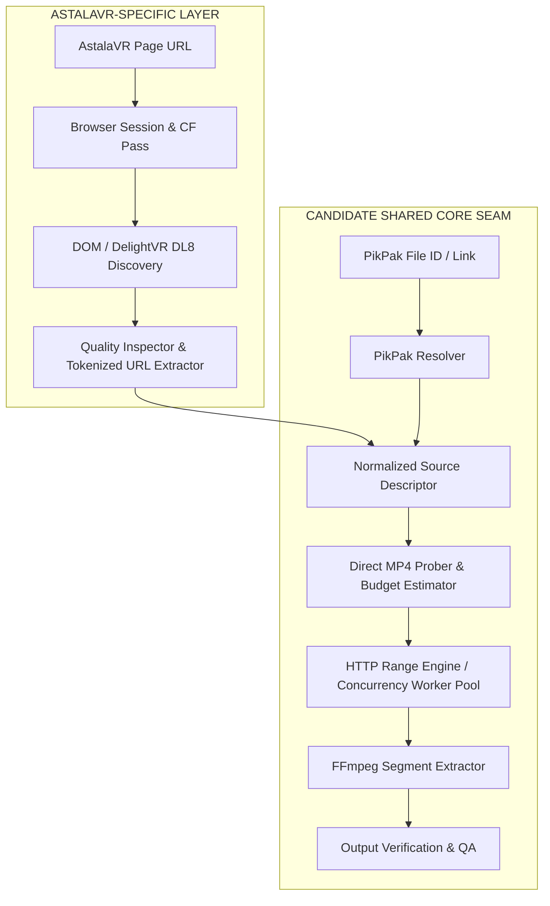

# AstalaVR Source Capability Boundary Research

> **Target Issue**: [#3 Turn AstalaVR reconnaissance into a source capability boundary](https://github.com/carllx/javr-sourcecut/issues/3)  
> **Research Branch**: `research/astalavr-capability-boundary`  
> **Status**: Complete / Ready for Review  
> **Evidence Classification**: `[VERIFIED]` / `[REPORTED]` / `[INFERRED]` / `[UNKNOWN]`

---

## 1. Executive Summary & Objective

本调研的目标是将已有的 AstalaVR 侦察证据（Reconnaissance Data）与初阶实验结果转化为一份**严格定级的 Source Capability Boundary（源能力边界）**文档，为 `javr-sourcecut` 的核心架构决策提供依据。

### 核心定界原则
1. **区分平台特有 vs 共享机制**：严格隔离 AstalaVR 平台特有的页面/会话/Token 机制与跨平台通用的 MP4 Range/FFmpeg 切片提取机制。
2. **能力边界而非代码实现**：不预设具体类名或最终 Adapter 代码实现，仅定义职责边界、输入输出契约与依赖约束。
3. **证据等级严格定级**：
   - `[VERIFIED]`：已有本地可复现的实验、HTTP/CDP 抓包响应头、ffprobe 元数据直接验证。
   - `[REPORTED]`：在历史抽样或特定浏览器会话中观察到的现象，尚未跨全量场景闭环。
   - `[INFERRED]`：基于协议规范或标准播放器/CDN 行为的合理架构推断。
   - `[UNKNOWN]`：尚未实测，必须在后续阶段设计验证 Hook 的未知项。
4. **合规与授权边界**：仅使用合法浏览器会话进行受控 probing（HEAD / bounded Range / ffprobe），不下载完整视频，不研究 DRM 绕过或访问控制逆向。

---

## 2. Primary Evidence Base (主要证据基线)

本次调研基于以下一手/本地实验证据：

1. **CDP & DOM Inspection Dump** (`scratch_browser_dump.json`):
   - 目标页面: `https://astalavr.com/videos/vzyr8/honjou-hana`
   - 捕获到 `<dl8-video>` 元素（Delight VR / WebXR），配置属性包括 `format="STEREO_180_LR"`, `fps="60"`, `display-mode="inline"`。
   - 捕获到内部声明的 `<source>` 列表及其时效性 CDN URL 与质量标签。
   - 捕获到 Cloudflare Challenge 相关响应（`__cf_chl_opt`, `cf_clearance`, `lcc`, `lrc`）。
2. **CDN HTTP 响应头与 Range 行为** (`headers_*.txt`, `head_*.txt`):
   - CDN 响应包含 `accept-ranges: bytes`、`access-control-allow-origin: https://astalavr.com`。
   - 缺少有效 Token/Cookie 或签名过期时，CDN 返回 `HTTP/1.1 403 Forbidden`（Cloudflare 拦截）。
3. **Stratified Sampling 采样集** (`complete_sampling_verified.json`, `sampling_report.json`):
   - 覆盖 10 个代表性样本（涵盖 Latest Western、Recent JAV、Indie Cosplay、Page 10/80/150/200 以及 Non-4K 对照组）。
   - 10/10 样本均未检测到 EME/DRM；
   - 9/9 标有 4K Badge 的样本在 CDN 声明中最高文件名为 `2048P.mp4`；
   - 页面标题标注 “8K” 的样本，其公开流最高仍为 `2048P.mp4`（4K 等级）。
4. **Bounded Range MP4 ffprobe 分析** (`sample_7gYMp.mp4`, `sample_vzwR3.mp4`):
   - 仅下载 5MB 首部数据即可通过 FastStart `moov` atom 读取完整流元数据。
   - `sample_7gYMp.mp4`: H.264 (High Profile, Level 5.2, `avc1`), 4096x2048 @ 60fps, AAC Stereo (`mp4a`).
   - `sample_vzwR3.mp4`: HEVC (Main Profile, Level 5.1 Main Tier, `hvc1`), 4096x2048 @ 60fps, AAC Stereo (`mp4a`).

---

## 3. Capability Boundary Matrix (能力边界矩阵)

### 3.1 ASTALAVR-SPECIFIC (平台特有能力边界)

本层负责与 AstalaVR 站点的特有业务与前端逻辑对接，对外输出标准化的媒体描述符（Source Descriptor）。

| 能力项 | 证据等级 | 详细说明与契约要求 |
| :--- | :---: | :--- |
| **Page Resolver** | `[VERIFIED]` | 输入 AstalaVR 视频页面 URL（如 `https://astalavr.com/videos/<id>/<slug>`），通过合法浏览器会话加载页面，提取视频 ID、标题、VR 格式属性（如 `format="STEREO_180_LR"`）。 |
| **Player / Source Discovery** | `[VERIFIED]` | 定位 Delight VR `<dl8-video>` 及其内部 `<source>` 标签，解析提取可用的 CDN Direct MP4 地址及对应标签（如 `720P`, `1440P`, `4K`）。 |
| **Quality Inspector & Mapping** | `[VERIFIED]` | **质量标签不等于实际分辨率**： • Badge `4K` / 标签 `4K` 映射到 CDN 文件名 `2048P.mp4`； • 实际 coded resolution 为 `4096x2048`（3D 180° SBS 双目，单眼 `2048x2048`）； • 标题中的 `8K` 宣称在当前公开流中**不可用**（严禁盲猜 4320P 等 URL）。 |
| **Browser Session & Anti-Bot** | `[VERIFIED]` | 页面受 Cloudflare 保护，依赖合法浏览器环境（Cookie: `cf_clearance`, `lcc`, `lrc` 等）完成一次性会话建立。纯非浏览器爬虫直连会触发 403。 |
| **Ephemeral Media URL Lifecycle** | `[VERIFIED]` | 媒体 URL 附带签名 Token（如 `?token=1787313883-...`），具备短期有效性。解析器获取的 URL 为**临时凭证**，禁止作为持久存储的媒体全局唯一标识。 |
| **Token Acquisition & Refresh** | `[REPORTED]` | 当下载长视频或多切片时，若 Token 过期，需要有机制通过当前会话重新触发页面解析以获取新 Token 的媒体 URL。 |

---

### 3.2 POSSIBLE SHARED SEAM (候选共享抽象层)

本层是 `javr-sourcecut` 通用的核心组件（Core Seams），可与 PikPak 及其他基于 HTTP Direct MP4 / Range 的源适配器共享。

| 能力项 | 证据等级 | 详细说明与候选共享契约 |
| :--- | :---: | :--- |
| **Normalized Source Identity** | `[INFERRED]` | 统一的源标识模型：`SourceDescriptor { source_id, provider: 'astalavr', display_title, vr_format, qualities: [...] }`。上层仅感知标准源模型，解耦具体平台 URL。 |
| **Edit Decision / Time Ranges (EDL)** | `[INFERRED]` | 统一的时间切片与剪辑决策模型：`CutSegment { start_time, end_time, target_fps, transcode_mode }`，完全与源提供者独立。 |
| **Direct MP4 Bounded Probing** | `[VERIFIED]` | **FastStart Moov Probe**：针对支持 HTTP Range 的 MP4 视频，仅发起小范围（如首部 5MB）Range 请求读取 `moov` atom，利用 `ffprobe` 快速判定 coded resolution、codec (H.264/HEVC)、fps、duration、bitrate。 |
| **HTTP Range Transport** | `[VERIFIED]` | 标准 HTTP 206 Partial Content 请求传输层：支持指定 Byte Range 请求、Header 注入、连接重试与分块接收。 |
| **Transfer Budgeting** | `[INFERRED]` | 传输预算控制：根据剪辑区间与码率估算所需下载的数据量，避免全量下载大文件，实施精确 Range 提取以节省带宽与磁盘。 |
| **Concurrency & Chunk Controls** | `[INFERRED]` | 并发分片下载/提取调度器：支持单文件多 Range 并发或多切片流水线作业，控制并发连接数以防触发 CDN 限流。 |
| **FFmpeg Segment Extraction** | `[VERIFIED]` | 结合 HTTP URL / 局部缓存与 FFmpeg 进行精确无损切片（`-ss ... -to ... -c copy`）或智能关键帧重编码切片。 |
| **Output Verification** | `[VERIFIED]` | 对导出的切片结果执行自动化完整性校验（ffprobe 检查帧率、时长偏差、音画流同步、有效分辨率）。 |

---

### 3.3 UNKNOWN / NEEDS HOOK (实现阶段待验证与拦截点)

以下项在侦察阶段无法完全闭环，必须在后续 Adapter / Engine 原型与开发阶段保留明确的 Hook 点与可复现验证方案。

| 未知项 / 待验证点 | 证据等级 | 风险评估与应对策略 (Needs Hook) |
| :--- | :---: | :--- |
| **Header / Session Propagation** | `[UNKNOWN]` | CDN 请求是否强依赖 `Referer`、`User-Agent` 或 `Cookie`？初步证据表明 CDN URL 依赖 Token，但跨域 Range 请求时是否校验 Session Header 需在传输层提供可插拔 Header 注入 Hook。 |
| **Token Expiry during Long Segment Pull** | `[UNKNOWN]` | Token 的具体 TTL 时长未知。若长分片下载耗时超过 Token 有效期，传输层需具备 `TokenExpiredError` 捕获及向上层请求 URL Refresh 的重试 Hook。 |
| **CDN Range Granularity & Rate Limiting** | `[REPORTED]` | CDN（Cloudflare）对高并发 HTTP Range 请求是否存在单 IP 速率限制或 429 降级？需要并发控制策略（默认 Conservative Concurrency）。 |
| **Multi-Range / Resumability Support** | `[UNKNOWN]` | CDN 是否支持 `multipart/byteranges` 或在断点续传中断时的任意字节续接？需做容错设计，优先采用单区间 Range 请求。 |
| **Source Uniformity across Catalog** | `[REPORTED]` | 10/10 抽样全为 Direct MP4 且无 DRM，但不能外推全站 100%。若遇到 HLS/DASH 或带 DRM 页面，架构必须直接抛出 `UnsupportedSourceFormatError` 或 `DRMProtectedSourceError` 并安全终止，严禁尝试逆向或绕过。 |

---

## 4. Architectural Boundaries & Cross-Source Comparison (与 PikPak 对照)

### 对比结论：
1. **源解析阶段完全分离**：AstalaVR 的输入是 HTML 页面，依赖浏览器 DOM / Delight VR 元素解析与短效 Token；PikPak 的输入是网盘文件 ID / 提取链接，依赖 API 鉴权与长效或可刷新的直链。
2. **传输与切片阶段高度共享**：一旦解析出 Direct MP4 直链与音视频元数据，两者的探测（Bounded ffprobe）、传输（HTTP 206 Range）、预算管理、切片（FFmpeg cut）及产物验证流程完全通用。

---

## 5. Verification Checklist & Gate for Subsequent Issues

- [x] 本地侦察产物（JSON/Dumps/ffprobe）已审查并归档引用。
- [x] 证据等级严格区分为 Verified / Reported / Inferred / Unknown。
- [x] AstalaVR-Specific vs Shared Seam vs Unknown 边界已清晰定义。
- [x] 明确不包含生产代码实现、全量下载器或 DRM 绕过。
- [x] 输出完整文档至 `docs/research/astalavr-source-capability-boundary.md`。
