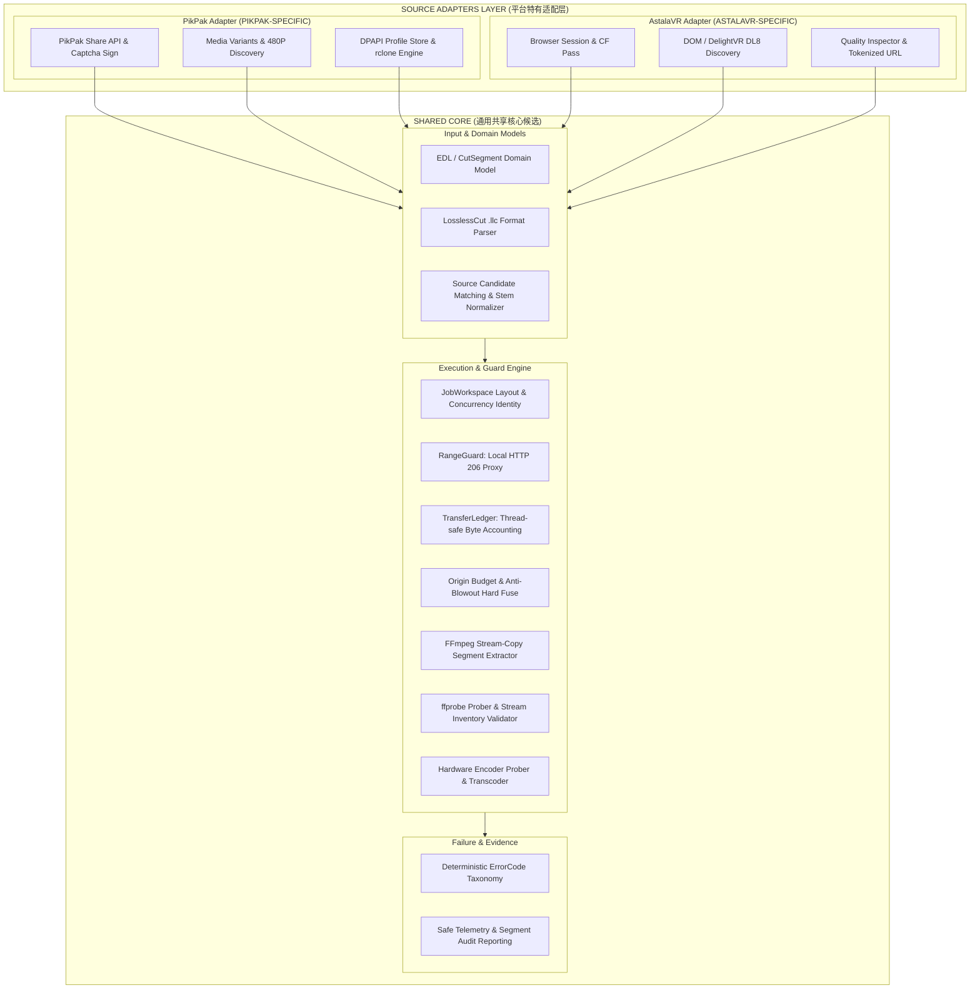

# PikPak Implementation Shared-Core Candidate Audit

> **Target Issue**: [#2 Audit PikPak implementation for shared-core candidates](https://github.com/carllx/javr-sourcecut/issues/2)  
> **Part of**: [#1 Wayfinder: multi-source SourceCut architecture and PikPak migration](https://github.com/carllx/javr-sourcecut/issues/1)  
> **Research Branch**: `research/pikpak-shared-core-audit`  
> **Audit Baseline Coordinate**: `f32e61da3cf4ac21aec644f5acafd0099db9cbc1` (verified baseline in `carllx/pikpak-llc-workflow`; note: subsequent local commit `bbc2fbd` adds only non-interactive CLI args to `profile_setup.py`)  
> **Status**: Complete / Ready for Review  
> **Evidence Classification**: `[VERIFIED]` / `[INFERRED]` / `[UNCERTAIN]`

---

## 1. Executive Summary & Audit Mission

本审计的目标是对成熟项目 `carllx/pikpak-llc-workflow`（以基线 commit `f32e61d` 为准）的全部生产模块、架构决策（ADR 0001–0003）、测试套件（133 passed tests）以及运营/故障证据进行深度代码与行为契约审计。

本项任务是**只读审计与能力定界**，不实施代码重构，不复制/迁移源码，不修改旧仓库，为后续 `Issue #4 Decide the Shared Core and Source Adapter boundary` 提供实证依据。

### 核心结论摘要

1. **三层清晰分离**：
   - **PIKPAK-SPECIFIC（源适配器层）**：PikPak Share API / Captcha 逆向算法、Media Variants / 480P / Origin 发现、rclone DPAPI 凭证存储与进程驱动、特定仓库 Operator Preflight。
   - **SHARED-CORE-CANDIDATE（共享核心候选）**：RangeGuard（本地 HTTP 206 守卫）、TransferLedger（并发安全传输账本）、Origin Budget（硬熔断预算算法）、FFmpeg/ffprobe 无损切片与流完整性校验、LosslessCut / EDL 解析、JobWorkspace 目录结构与并发身份隔离模型、硬件编码器嗅探与压制辅助。
   - **UNCERTAIN（跨平台边界待澄清）**：多来源 Job 输入元数据统一规范、传输层对非 HTTP Range 协议（HLS / DASH）的扩展 seam、长切片或多切片过程中的 Token 过期重试与 URL Refresh 契约。

2. **实证校准（消除文件名盲猜）**：
   - `llc_parser` 虽为通用 JSON5 解析，但 Shared Core 领域模型应面向规范化的 `CutSegment` / `TimeRange`，而非永久强绑定 `.llc` 专有文件格式。
   - `origin_budget` 基于时长比例估算字节上限，在 Direct MP4 等线性容器 Range 场景下通用，但不应假设所有流媒体（如已具备显式分片列表的 HLS）都采用估算模式。
   - `RangeGuard` 与 `TransferLedger` 严格遵循标准 RFC 7233 HTTP Range 语义，完全独立于 PikPak，可直接服务任意 Direct MP4 HTTP Range 来源。
   - FFmpeg 切片与 `ffprobe` 校验逻辑通用，但暗含了输入为 FastStart/Seekable MP4 容器及 `-c copy` 关键帧边界对齐的流媒体特性。

---

## 2. Audit Evidence Base (审计坐标与证据基线)

本次审计基于以下一手资料与代码证据：

1. **基线 Commit 坐标**：
   - 坐标 Commit：`f32e61da3cf4ac21aec644f5acafd0099db9cbc1`
   - Master 当前 HEAD：`bbc2fbd5fc2ae3bec972be3212167c184dd7e003`（仅引入 `profile_setup.py` 的 `--user`/`--password` CLI 参数与测试，不改变任何核心工作流与契约）。
2. **架构决策记录 (ADRs)**：
   - [`ADR-0001: 使用稳定 file_id 选择 Share 视频`](file:///E:/PROJECTS/pikpak-llc-workflow/docs/adr/0001-stable-share-file-selection.md)
   - [`ADR-0002: Job Workspace and Output Contract`](file:///E:/PROJECTS/pikpak-llc-workflow/docs/adr/0002-job-workspace-output-contract.md)
   - [`ADR-0003: Zero-friction authenticated PikPak profile`](file:///E:/PROJECTS/pikpak-llc-workflow/docs/adr/0003-zero-friction-authenticated-profile.md)
3. **生产源码与测试套件**：
   - `src/pikpak_llc/*.py`（共 12 个核心模块，全部严格遵守 ≤ 600 行物理行数红线）。
   - `tests/test_*.py`（全量 133 个单元/集成/并发/回归测试，本地 `133 passed in 19.69s`）。
4. **故障与运营实证**：
   - [`docs/incidents/2026-08-14-vrkm-962-3.md`](file:///E:/PROJECTS/pikpak-llc-workflow/docs/incidents/2026-08-14-vrkm-962-3.md)（排除了 CDN 假性 416 物理空洞假说，确立了 Authenticated 原画探针权威性与预算上限修正）。
   - [`docs/operations/origin-troubleshooting.md`](file:///E:/PROJECTS/pikpak-llc-workflow/docs/operations/origin-troubleshooting.md)（定义了确定性的 6 级故障诊断决策树与退出闸门）。

---

## 3. Comprehensive Capability Audit (各能力项深度审计)

### 3.1. LLC Parsing & Normalized Time Ranges

- **对应源码**: [`src/pikpak_llc/llc_parser.py`](file:///E:/PROJECTS/pikpak-llc-workflow/src/pikpak_llc/llc_parser.py), [`src/pikpak_llc/experimental_workflow.py:30-40`](file:///E:/PROJECTS/pikpak-llc-workflow/src/pikpak_llc/experimental_workflow.py#L30-L40)
- **对应测试**: [`tests/test_llc_parser.py`](file:///E:/PROJECTS/pikpak-llc-workflow/tests/test_llc_parser.py), [`tests/fixtures/losslesscut-3.69-real.llc`](file:///E:/PROJECTS/pikpak-llc-workflow/tests/fixtures/losslesscut-3.69-real.llc)
- **证据等级**: `[VERIFIED]`
- **当前职责**:
  1. 解析 LosslessCut v3.x 项目文件（JSON5 / JS Object 语法），提取 `mediaFileName` 与 `cutSegments` 列表。
  2. 校验时间戳为合法浮点数、非负起始时间 (`start >= 0`)，且结束时间严格大于起始时间 (`end > start`)。
- **PikPak 依赖**: **无**。纯基于 `json5` 与标准数学运算。
- **分类**: **`SHARED-CORE-CANDIDATE`**（格式解析层 / 规范化时间区间模型）。
- **未来抽取须保留的 Invariant**:
  - `end > start` 严格单调性，拒绝 0 时长或负时长片段。
  - 保留原始 `mediaFileName` 字符串供下游源匹配使用，不在此阶段擅自截断或修改文件名。
- **绝对不应抽进 Shared Core 的部分**:
  - 核心业务层不应直接依赖特定的 `.llc` 专有文件结构；Shared Core 核心流应消费抽象的 `CutSegment(start, end, label)` 与 `EditDecisionList` 领域模型，而将 `LosslessCutParser` 作为 Format Adapter。

---

### 3.2. Source Matching & Stem Normalization

- **对应源码**: [`src/pikpak_llc/pikpak_api.py:311-336`](file:///E:/PROJECTS/pikpak-llc-workflow/src/pikpak_llc/pikpak_api.py#L311-L336) (`select_share_video`, `_matching_stem`), [ADR-0001](file:///E:/PROJECTS/pikpak-llc-workflow/docs/adr/0001-stable-share-file-selection.md)
- **对应测试**: [`tests/test_pikpak_api.py`](file:///E:/PROJECTS/pikpak-llc-workflow/tests/test_pikpak_api.py)
- **证据等级**: `[VERIFIED]`
- **当前职责**:
  - 输入候选媒体列表与 LLC 中的 `mediaFileName`，执行两阶段唯一源匹配：
    1. 不区分大小写的精确文件名匹配。
    2. 剥离常见代理后缀（`_h264`, `-h264`, `_p480`, `-p480`）的主干名（stem）唯一匹配。
  - 若匹配数为 0 或 >1（存在歧义），抛出 `SourceSelectionError` 强行失败，禁止猜测。
- **PikPak 依赖**: 当前实现接收字典列表 `[{"filename": ..., "candidate_type": "video"}]`，但匹配算法本身仅依赖字符串与路径操作。
- **分类**: **`SHARED-CORE-CANDIDATE`**。
- **未来抽取须保留的 Invariant**:
  - **唯一匹配准则**：匹配项必须严格为 1。0 或多项匹配必须立即 Fail-Closed，绝不退化为 `[0]` 或隐式默认项。
  - 优先精确文件名匹配，后备 stem 规则匹配。
- **绝对不应抽进 Shared Core 的部分**:
  - 具体源平台候选视频列表的获取逻辑（如从 PikPak API 响应或 HTML 解析）。

---

### 3.3. Workspace Layout, Job Identity & Output Contract

- **对应源码**: [`src/pikpak_llc/workspace.py`](file:///E:/PROJECTS/pikpak-llc-workflow/src/pikpak_llc/workspace.py), [ADR-0002](file:///E:/PROJECTS/pikpak-llc-workflow/docs/adr/0002-job-workspace-output-contract.md)
- **对应测试**: [`tests/test_workspace.py`](file:///E:/PROJECTS/pikpak-llc-workflow/tests/test_workspace.py), [`tests/test_job_concurrency.py`](file:///E:/PROJECTS/pikpak-llc-workflow/tests/test_job_concurrency.py)
- **证据等级**: `[VERIFIED]`
- **当前职责**:
  - 提供单次处理任务的标准目录隔离：`workspace/jobs/<job-id>/{proxies,projects,segments,reports,temp}`。
  - 生成由 UTC 时间戳与输入哈希组成的确定性 `job_id`（如 `20260821T143010Z-3d4bdcec60`）。
  - 支持多视频/多 LLC 项目在同一 Job 内并行工作，原画切片按 `segments/<source-stem>/` 独立落盘。
  - 维护用户可见的公共输出契约（仅暴露绝对 `PROXY_DIR` 与 `SEGMENTS_DIR`）。
  - 提供并发安全的 Job 上下文（显式 `job_id` 为 SSOT，`LATEST.txt` 仅作无状态恢复缺省指针，防止并发任务踩踏）。
- **PikPak 依赖**:
  - `start_share(share_url)` 方法名及 `job.json` 中保存 `{"share": share_url}` 字段。
- **分类**: **`SHARED-CORE-CANDIDATE`**（核心目录与执行隔离架构），其中元数据字段需规范化。
- **未来抽取须保留的 Invariant**:
  - 严格的工作区路径封装与目录防逃逸校验（`relative_to(job_root)`）。
  - 执行期并发安全：任务一旦启动，全生命周期绑定显式 `JobPaths`，不得在执行过程中动态读取可变的 `LATEST.txt`。
  - 公共输出路径契约（`PROXY_DIR` 与 `SEGMENTS_DIR`）的稳定性。
- **绝对不应抽进 Shared Core 的部分**:
  - 硬编码的 `share_url` 字段名或假设所有输入均为单个 HTTP 分享 URL。

---

### 3.4. Origin Budget & Hard Fuse Estimation

- **对应源码**: [`src/pikpak_llc/origin_budget.py`](file:///E:/PROJECTS/pikpak-llc-workflow/src/pikpak_llc/origin_budget.py), [Incident VRKM-962-3](file:///E:/PROJECTS/pikpak-llc-workflow/docs/incidents/2026-08-14-vrkm-962-3.md)
- **对应测试**: [`tests/test_origin_budget.py`](file:///E:/PROJECTS/pikpak-llc-workflow/tests/test_origin_budget.py)
- **证据等级**: `[VERIFIED]`
- **当前职责**:
  - 计算局部原画提取的保护性传输上限：
    $$\text{estimated} = \text{origin\_total} \times \frac{\text{selected\_duration}}{\text{source\_duration}}$$
  - 叠加裕量系数（默认 2.0x）与索引/Seek 开销（默认 128 MiB），按 16 MiB 向上对齐。
  - 硬熔断门禁：当估算字节 $\text{estimated} \ge 80\% \times \text{origin\_total}$ 时，判定失去局部下载意义，直接抛出 `BudgetConfirmationRequired` 阻断全片盗刷。
  - 当估算正常但带裕量上限超出 80% 时，将上限钳位在 80% 边界，确保不静默扩大带宽预算。
- **PikPak 依赖**: **无**。纯数学与字节边界控制。
- **分类**: **`SHARED-CORE-CANDIDATE`**（针对 Direct MP4 / Range 类传输的安全熔断模型）。
- **未来抽取须保留的 Invariant**:
  - 严格的主动阻断：超出阈值时必须在发起网络传输前抛错，绝不静默下载。
  - 所有数值必须为严格正数，拒绝非法时长或文件体积。
- **绝对不应抽进 Shared Core 的部分**:
  - 不应强行将此比例估算模型套用到天然分片且元数据已知各分片精确字节的流媒体协议（如 HLS / DASH）。

---

### 3.5. RangeGuard (Localhost HTTP Range Proxy)

- **对应源码**: [`src/pikpak_llc/range_guard.py:251-340`](file:///E:/PROJECTS/pikpak-llc-workflow/src/pikpak_llc/range_guard.py#L251-L340)
- **对应测试**: [`tests/test_range_guard.py`](file:///E:/PROJECTS/pikpak-llc-workflow/tests/test_range_guard.py)
- **证据等级**: `[VERIFIED]`
- **当前职责**:
  - 启动仅监听 `127.0.0.1` 随机可用端口的轻量 HTTP 代理服务，为 FFmpeg / ffprobe 提供受控媒体读取入口。
  - 将下游客户端的 HTTP GET Range 请求透明转发至上游真实媒体 URL。
  - 实时校验上游响应头：严格要求 `HTTP 206 Partial Content` 与有效 `Content-Range`。
  - 遇到上游 `HTTP 200 OK`（返回完整大文件）时，**立即关闭连接并中断传输**，彻底杜绝全量下载。
  - 安全脱敏：任何日志与事件记录中剥离上游 URL 的查询参数、签名 Token 或凭证。
  - 容错处理：下游播放器/FFmpeg 正常 seek 导致的连接重置（`BrokenPipeError` / `ConnectionResetError`）标记为 `CLIENT_CLOSED`，不误报为系统异常。
- **PikPak 依赖**: **无**。完全基于标准 HTTP RFC 7233 协议与 Python 标准库 `ThreadingHTTPServer`。
- **分类**: **`SHARED-CORE-CANDIDATE`**（核心防全量下载保护 Seam）。
- **未来抽取须保留的 Invariant**:
  - `127.0.0.1` 本地回环绑定，禁止对外暴露。
  - `HTTP 200` 强力熔断拦截（Anti-Bandwidth Blowout）。
  - 上游 Token/URL 安全脱敏。
  - 退出上下文时必须优雅关闭 Server 并 join 线程，无资源泄漏。
- **绝对不应抽进 Shared Core 的部分**:
  - 特定源平台的鉴权 Header 构造逻辑。

---

### 3.6. TransferLedger & Concurrency/Budget Accounting

- **对应源码**: [`src/pikpak_llc/range_guard.py:32-87`](file:///E:/PROJECTS/pikpak-llc-workflow/src/pikpak_llc/range_guard.py#L32-L87)
- **对应测试**: [`tests/test_range_guard.py:181-283`](file:///E:/PROJECTS/pikpak-llc-workflow/tests/test_range_guard.py#L181-L283)
- **证据等级**: `[VERIFIED]`
- **当前职责**:
  - 维护单次任务的全局字节传输账本，基于 `threading.Lock` 保证并发与多连接线程安全。
  - 支持前置预留（`reserve`）、流式消费（`consume`）、放弃退还（`release`）以及工作流单调升容（`increase_max_bytes`）。
  - 在累计传输即将超出配置预算时抛出 `TransferBudgetExceeded`，从源头切断网络数据流。
  - 收集并输出标准化的 `RangeEvent` 证据流水。
- **PikPak 依赖**: **无**。纯 Python 线程安全数据结构。
- **分类**: **`SHARED-CORE-CANDIDATE`**。
- **未来抽取须保留的 Invariant**:
  - 线程级原子性与无死锁保证。
  - 账本配额只能单调递增，禁止下调至已消耗/已预留字节之下。
  - 下溢与溢出保护。
- **绝对不应抽进 Shared Core 的部分**:
  - 无。此组件为极度纯粹的高内聚基础原语。

---

### 3.7. FFmpeg Segment Extraction & Media Probing

- **对应源码**: [`src/pikpak_llc/authenticated_workflow.py:36-82`](file:///E:/PROJECTS/pikpak-llc-workflow/src/pikpak_llc/authenticated_workflow.py#L36-L82), [`src/pikpak_llc/experimental_workflow.py:61-174`](file:///E:/PROJECTS/pikpak-llc-workflow/src/pikpak_llc/experimental_workflow.py#L61-L174)
- **对应测试**: [`tests/test_experimental_workflow.py`](file:///E:/PROJECTS/pikpak-llc-workflow/tests/test_experimental_workflow.py), [`tests/test_authenticated_workflow.py`](file:///E:/PROJECTS/pikpak-llc-workflow/tests/test_authenticated_workflow.py)
- **证据等级**: `[VERIFIED]`
- **当前职责**:
  - 利用 FFmpeg 输入端精确 Seek 语法（`-ss <start> -to <end> -i <guard_url> -map 0 -c copy <output>`）执行无损流复制提取。
  - 文件覆盖保护（`-n` 与冲突检测）。
  - 执行 `ffprobe` 媒体探测，提取格式、时长、流信息。
  - 产物质量把关：
    - `output_is_playable`: 时长 > 0 且包含有效视频流。
    - `stream_inventory`: 验证源文件全部音轨、视频轨与字幕轨被 100% 完整保留在输出切片中。
- **PikPak 依赖**: **无**。依赖系统 `ffmpeg` 与 `ffprobe` CLI。
- **分类**: **`SHARED-CORE-CANDIDATE`**。
- **未来抽取须保留的 Invariant**:
  - `-map 0 -c copy` 默认无损流复制（原画片段禁止二次有损转码）。
  - 禁止静默覆盖已存在的切片文件。
  - 交付前必须通过可播放性（Playable Gate）与流完整性（Stream Inventory Gate）双重校验。
- **绝对不应抽进 Shared Core 的部分**:
  - 假定所有输入均为标准 MP4（虽优先支持 MP4，但接口应支持容器类型参数化或可插拔能力探测）。

---

### 3.8. Failure Taxonomy & Safe Telemetry Reporting

- **对应源码**: [`src/pikpak_llc/failure_taxonomy.py`](file:///E:/PROJECTS/pikpak-llc-workflow/src/pikpak_llc/failure_taxonomy.py), [`src/pikpak_llc/authenticated_workflow.py:84-188`](file:///E:/PROJECTS/pikpak-llc-workflow/src/pikpak_llc/authenticated_workflow.py#L84-L188)
- **对应测试**: [`tests/test_authenticated_workflow.py`](file:///E:/PROJECTS/pikpak-llc-workflow/tests/test_authenticated_workflow.py)
- **证据等级**: `[VERIFIED]`
- **当前职责**:
  - 将运行期各类异常（预算超限、鉴权失效、源匹配歧义、FFmpeg 失败、产物损坏等）映射为确定性的全局标准错误码（`ErrorCode`）。
  - 输出结构化的执行报告 JSON，精确标记每个 LLC 项目与每个 Segment 的状态（`PASS` / `FAIL` / `NOT_RUN`）。
  - 确保报告仅包含安全遥测数据（累计字节、Range 事件、流属性），杜绝签名 URL 与凭据泄露。
- **PikPak 依赖**:
  - 当前代码直接引入了 `ProfileProvisioningRequired`、`RcloneTargetError` 等 PikPak 驱动层异常类。
- **分类**: **`SHARED-CORE-CANDIDATE`**（故障分类与安全遥测架构），具体错误类采用分层或注册机制解耦。
- **未来抽取须保留的 Invariant**:
  - 确定性错误码映射（无静默吞错、无未分类泛型异常逃逸）。
  - 遥测数据安全脱敏。
  - 片段级粒度的失败原因归因。
- **绝对不应抽进 Shared Core 的部分**:
  - 具体适配器特有的异常类型硬编码到 Core 的 `classify_error` 中。

---

### 3.9. Hardware Encoder Probing & Transcoding Helpers

- **对应源码**: [`src/pikpak_llc/download_proxy.py:13-74, 94-135`](file:///E:/PROJECTS/pikpak-llc-workflow/src/pikpak_llc/download_proxy.py#L13-L74)
- **对应测试**: [`tests/test_download_proxy.py`](file:///E:/PROJECTS/pikpak-llc-workflow/tests/test_download_proxy.py)
- **证据等级**: `[VERIFIED]`
- **当前职责**:
  - 自动嗅探本地可用的硬件加速编码器：按优先级实测探测 `h264_nvenc`（NVIDIA）、`h264_qsv`（Intel）、`h264_amf`（AMD），无法使用时平滑回退至 `libx264`（CPU）。
  - 生成针对 LosslessCut 剪辑友好的 H.264 / AAC 代理视频参数（含 `-movflags +faststart`、CRF/CQ 23、恒定帧率）。
  - 压制产物经过 `_probe_compatible_proxy` 验证，确认具备有效 H.264 视频轨与正常时长。
- **PikPak 依赖**: **无**。依赖系统 FFmpeg 编码器支持。
- **分类**: **`SHARED-CORE-CANDIDATE`**（媒体处理工具库）。
- **未来抽取须保留的 Invariant**:
  - 硬件编码器必须经过实际 1 帧试编码探测（`_can_encode_with`），严禁仅凭字符串推断。
  - 生成产物必须包含 `+faststart`，保障剪辑软件毫秒级响应。
- **绝对不应抽进 Shared Core 的部分**:
  - 无。

---

### 3.10. PikPak Share API Client & Media Discovery

- **对应源码**: [`src/pikpak_llc/pikpak_api.py:24-309`](file:///E:/PROJECTS/pikpak-llc-workflow/src/pikpak_llc/pikpak_api.py#L24-L309)
- **对应测试**: [`tests/test_pikpak_api.py`](file:///E:/PROJECTS/pikpak-llc-workflow/tests/test_pikpak_api.py)
- **证据等级**: `[VERIFIED]`
- **当前职责**:
  - 构造与生成 PikPak 专有客户端请求头与 MD5 Captcha 签名（`WEB_ALGORITHMS` 盐链）。
  - 请求 PikPak 开放分享接口 `/drive/v1/share` 与 `/drive/v1/share/file_info`。
  - 枚举提取 `files[]`，判定候选文件类型（`video` vs `non_video`）。
  - 解析候选媒体的 `medias[]` 转码变体（获取 480P Proxy URL 与 `MEDIA_ORIGIN` 直链）。
- **PikPak 依赖**: **100% PikPak 专有**。
- **分类**: **`PIKPAK-SPECIFIC`**（PikPak Source Adapter 专属）。
- **绝对不应抽进 Shared Core 的部分**:
  - PikPak API 域名、Header 常量、设备 ID 生成规则、Captcha MD5 签名盐序列、JSON 响应解析逻辑。

---

### 3.11. Authenticated Transport & rclone Lifecycle

- **对应源码**: [`src/pikpak_llc/authenticated_transport.py`](file:///E:/PROJECTS/pikpak-llc-workflow/src/pikpak_llc/authenticated_transport.py), [`src/pikpak_llc/rclone_adapter.py`](file:///E:/PROJECTS/pikpak-llc-workflow/src/pikpak_llc/rclone_adapter.py), [`src/pikpak_llc/profile_setup.py`](file:///E:/PROJECTS/pikpak-llc-workflow/src/pikpak_llc/profile_setup.py), [ADR-0003](file:///E:/PROJECTS/pikpak-llc-workflow/docs/adr/0003-zero-friction-authenticated-profile.md)
- **对应测试**: [`tests/test_authenticated_transport.py`](file:///E:/PROJECTS/pikpak-llc-workflow/tests/test_authenticated_transport.py), [`tests/test_rclone_adapter.py`](file:///E:/PROJECTS/pikpak-llc-workflow/tests/test_rclone_adapter.py), [`tests/test_profile_setup.py`](file:///E:/PROJECTS/pikpak-llc-workflow/tests/test_profile_setup.py)
- **证据等级**: `[VERIFIED]`
- **当前职责**:
  - Windows DPAPI（`CryptProtectData`/`CryptUnprotectData`）加密存储 PikPak rclone 配置至 `%LOCALAPPDATA%\PikPakLLC\profiles\`。
  - 运行时临时生成明文 `rclone.conf`，启动独立 `rclone serve http` 守护进程，强制 `--pikpak-no-media-link` 以提供可靠的原画局部 Range 读取。
  - 在 `finally` 块中严格销毁明文配置并终止 rclone 进程。
  - 自动定位目标文件名并匹配唯一远程文件（`find_unique_file`）。
- **PikPak 依赖**: 深度绑定 PikPak rclone backend、`pikpak_gate` remote 名称与特定 CLI 参数。
- **分类**: **`PIKPAK-SPECIFIC`**（PikPak Authenticated Driver）。
- **设计模式价值 (Pattern to Adopt)**:
  - 虽然具体实现是 PikPak-specific，但其对外呈现的**上下文管理器抽象**：
    `with transport.open_for(source_identifier) as opened: ...`（产出包含标准 URL 与 Total Size 的流对象，并在退出时自动回收鉴权/进程资源），是 Shared Core 定义 `SourceTransport` 接口的标准典范。
- **绝对不应抽进 Shared Core 的部分**:
  - rclone 进程启动参数、`--pikpak-no-media-link` 选项、DPAPI 存储中与 rclone 绑定的专有格式。

---

### 3.12. Operator Preflight & Governance

- **对应源码**: [`src/pikpak_llc/operator_preflight.py`](file:///E:/PROJECTS/pikpak-llc-workflow/src/pikpak_llc/operator_preflight.py)
- **对应测试**: [`tests/test_operator_preflight.py`](file:///E:/PROJECTS/pikpak-llc-workflow/tests/test_operator_preflight.py)
- **证据等级**: `[VERIFIED]`
- **当前职责**:
  - 校验运行环境是否为 `E:\PROJECTS\pikpak-llc-workflow` 规范工作树。
  - 拦截遗留代码文件 `origin_segment_extractor.py`。
  - 校验当前分支为 `master` 且追踪文件状态干净（clean）。
- **PikPak 依赖**: 硬编码了旧仓库路径、特定遗留文件名与旧仓库模块列表。
- **分类**: **`PIKPAK-SPECIFIC`**。
- **未来抽取考量**:
  - 新项目 `javr-sourcecut` 会有自身的工程治理规范，不应继承旧项目的硬编码路径。

---

## 4. Special Deep-Dive Verifications (关键假设深度核实)

针对调研指令第 7 条的专项核验：

### 4.1. `llc_parser` 是否真正平台无关？
- **核验结论**: **代码逻辑平台无关，但架构定位需降级为 Format Adapter**。
- **证据**: `llc_parser.py` 内部仅使用 `json5` 解析 `.llc` 格式，提取 `mediaFileName` 与区间。它对 PikPak 毫无感知。
- **架构校准**: 在多来源（如 AstalaVR、本地文件等）架构中，用户可能使用 LosslessCut、EDL、Final Cut XML 或直接提供时间列表。Shared Core 内部应使用通用的 `CutSegment` 数据结构；`llc_parser` 应作为输入格式适配器之一，而非 Core 唯一入口。

### 4.2. `origin_budget` 是否真正平台无关？
- **核验结论**: **在 Direct Range / MP4 场景下平台无关；但不能作为唯一全局预算模型**。
- **证据**: `origin_budget.py` 的算法本质是基于恒定/平均码率假设的线性字节估算 $\frac{\text{Selected}}{\text{Total}} \times \text{Size}$。在 Direct MP4 Progressive Range（如 PikPak 原画、AstalaVR Direct MP4）中极其有效且完全跨平台。
- **架构校准**: 若后续引入 HLS / DASH 源，分片列表（Playlist/Manifest）已包含精确的分片时长与字节数，此时预算控制是精确求和而非经验估算。因此 `origin_budget` 属于 **`Shared-Core (Range/Linear Transport Policy)`**。

### 4.3. `RangeGuard` / `TransferLedger` 是否可以服务任意 Direct MP4 Range source？
- **核验结论**: **完全可以直接服务任意 Direct MP4 Range 源**。
- **证据**: 
  1. `RangeGuard` 发起标准的 HTTP `Range: bytes=X-Y` 请求，接收标准的 `HTTP 206 Partial Content` 与 `Content-Range: bytes X-Y/Total` 响应头。
  2. `TransferLedger` 只做基于 Lock 的字节计数与配额限制。
  3. `tests/test_range_guard.py` 中的 17 个测试全量基于标准 HTTP 协议 Mock，无任何 PikPak 特有逻辑。
  4. AstalaVR 侦察已证实其 CDN 输出带签名 Token 的 Direct MP4 并支持标准 HTTP Range。`RangeGuard` 可零修改直接接入。

### 4.4. FFmpeg extraction / validation 中是否暗含 PikPak 假设？
- **核验结论**: **暗含了 MP4 容器与关键帧 Seek 假设，但不含 PikPak 平台业务假设**。
- **证据**:
  1. `build_segment_command` 使用 `-ss ... -to ... -i <url> -map 0 -c copy`。这要求输入容器支持输入端快速 Seek（如 FastStart MP4 的 moov 在前，或通过 HTTP Range 先定位 moov）。
  2. `require_mp4_origin` 显式校验了 `format_name` 包含 `mp4`。
  3. 关键帧对齐（Keyframe Aligned）：流复制不重编码视频，切片起点将吸附在最近的关键帧（Keyframe/I-frame），存在微小的前卷（Preroll）时长。这是所有基于 FFmpeg Stream Copy 的物理通则，非 PikPak 特有。
- **架构校准**: Shared Core 的切片引擎应以 Direct MP4 Stream Copy 为主通道，同时预留重编码/精准切片模式扩展点。

---

## 5. Capability Classification Matrix (能力分类与边界矩阵)

| 能力模块 / 组件 | 当前代码位置 | 分类 | 依赖性质 / 抽取说明 |
| :--- | :--- | :---: | :--- |
| **LLC Parser** | `src/pikpak_llc/llc_parser.py` | **`SHARED-CORE-CANDIDATE`** | 纯 JSON5 解析，作为 LosslessCut 输入适配器抽入共享层。 |
| **Normalized Segments Validation** | `src/pikpak_llc/experimental_workflow.py:30-40` | **`SHARED-CORE-CANDIDATE`** | 纯数学范围验证，抽入共享核心数据模型。 |
| **Source Matching & Stem Normalizer** | `src/pikpak_llc/pikpak_api.py:311-336` | **`SHARED-CORE-CANDIDATE`** | 独立于源平台的候选文件名/代理后缀标准化匹配算法。 |
| **JobWorkspace & Concurrency Identity** | `src/pikpak_llc/workspace.py` | **`SHARED-CORE-CANDIDATE`** | 标准工作区目录架构与并发安全隔离模型，需泛化 `job.json` 元数据结构。 |
| **Origin Budget Calculation** | `src/pikpak_llc/origin_budget.py` | **`SHARED-CORE-CANDIDATE`** | 针对 Direct MP4 / Range 传输的比例硬熔断算法。 |
| **RangeGuard** | `src/pikpak_llc/range_guard.py:251-340` | **`SHARED-CORE-CANDIDATE`** | 本地回环 HTTP 206 守卫与 HTTP 200 强力熔断拦截器。 |
| **TransferLedger** | `src/pikpak_llc/range_guard.py:32-87` | **`SHARED-CORE-CANDIDATE`** | 线程安全、支持单调升容的全局流量配额账本。 |
| **FFmpeg Segment Extractor** | `src/pikpak_llc/authenticated_workflow.py:36-82` | **`SHARED-CORE-CANDIDATE`** | 结合 RangeGuard 的无损流复制切片提取引擎。 |
| **ffprobe Prober & Stream Inventory** | `src/pikpak_llc/experimental_workflow.py:61-136` | **`SHARED-CORE-CANDIDATE`** | 媒体可播放性校验与源流轨道完整性比对门禁。 |
| **Hardware Encoder Prober** | `src/pikpak_llc/download_proxy.py:13-74` | **`SHARED-CORE-CANDIDATE`** | 运行时自动嗅探 NVENC/QSV/AMF/x264 并生成规范参数。 |
| **Failure Taxonomy & Reporting** | `src/pikpak_llc/failure_taxonomy.py` | **`SHARED-CORE-CANDIDATE`** | 确定性错误码分类与安全脱敏遥测报告生成。 |
| **PikPak Share API Client** | `src/pikpak_llc/pikpak_api.py:24-309` | **`PIKPAK-SPECIFIC`** | 平台专有 Captcha 逆向、API 请求与数据结构解析，保留在 PikPak Adapter。 |
| **Authenticated DPAPI & rclone** | `src/pikpak_llc/authenticated_transport.py`, `rclone_adapter.py` | **`PIKPAK-SPECIFIC`** | PikPak 专有 rclone 鉴权生命周期与 DPAPI 存储，保留在 PikPak Adapter。 |
| **Operator Preflight (Old Repo)** | `src/pikpak_llc/operator_preflight.py` | **`PIKPAK-SPECIFIC`** | 旧仓库特有的治理检查，不抽入新仓库共享层。 |
| **Multi-Source Job Metadata Schema** | `src/pikpak_llc/workspace.py` (`job.json`) | **`UNCERTAIN`** | 需在 Issue #4 统一定义跨源描述符格式（支持 URL / ID / Provider）。 |
| **Dynamic URL / Token Refresh Hook** | `src/pikpak_llc/authenticated_transport.py` | **`UNCERTAIN`** | 当 Range 请求因短效 Token 过期报 401/403 时的重试/刷新协议 Seam。 |

---

## 6. Unresolved Questions & Fog for Subsequent Issues

以下问题留待 **Issue #4 (Decide Shared Core and Source Adapter boundary)** 结合 AstalaVR 调研结论共同裁决：

1. **Source Descriptor 统一抽象**：
   - PikPak 的定位输入是 `share_url` / `file_id`；AstalaVR 的输入是 Web 页面 URL 与临时 Token 媒体直链。Shared Core 的 Job 元数据和源描述符应采用何种统一格式？
2. **动态 Token 刷新 Seam**：
   - AstalaVR 等 Web 源的 CDN URL 具有短效生命周期（如数小时）。若长切片提取中途 Token 失效，`RangeGuard` 是否需要向上层 `SourceAdapter` 触发回调请求重新解析 URL？
3. **PikPak 代码迁移形态**：
   - 在确定 Shared Core 边界后，PikPak 代码是以独立包、子模块还是同仓库内的 `adapters/pikpak` 形式存在？（需待 Issue #4 最终决策）。

---

## 7. Verification Checklist

- [x] 基于基线 commit `f32e61da3cf4ac21aec644f5acafd0099db9cbc1` 核实全部实现与测试（133 passed tests）。
- [x] 旧项目仅作为只读参考，未作任何修改或提交。
- [x] 全面覆盖 12+ 项核心能力，逐一回答职责、依赖、分类、Invariant 与排除边界。
- [x] 深度核验 `llc_parser`、`origin_budget`、`RangeGuard`、FFmpeg 假设。
- [x] 产物保存至 `docs/research/pikpak-shared-core-audit.md` 并包含详细代码/测试/ADR 引用。
